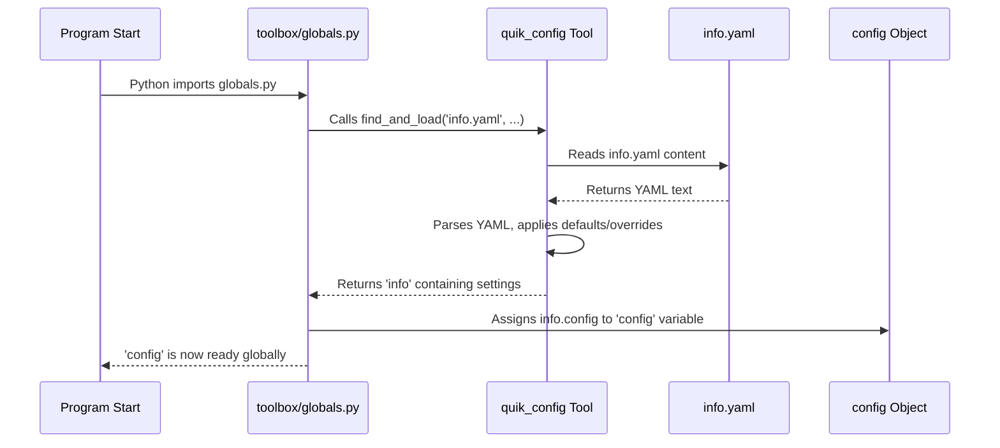

# Chapter 2: Global Configuration (`config`)

In the [previous chapter](01_main_execution_loop_.md), we saw how the [Main Execution Loop](01_main_execution_loop_.md) acts like a manager, coordinating different parts of our auto-aim system (like the camera, the aiming logic, etc.) to work together frame after frame. But how do we tell these different parts *how* to behave? For instance, how do we tell the system which camera to use, or how sensitive the target detection should be?

## The Problem: Hardcoded Settings are Bad!

Imagine you built a robot car that follows a red ball. You wrote the code, and deep inside, you put `camera_number = 0` (for your built-in webcam) and `target_color = "red"`.

Now, what happens if:

1.  You get a new, better camera that shows up as `camera_number = 1`?
2.  Your friend wants to use the same code, but their robot needs to follow a *blue* ball?
3.  You want to adjust how confidently the robot must see the ball before following it (the "detection threshold")?

You'd have to dig through the code, find these specific values, change them, and re-run the program. If these settings are used in many different files, you might miss one! This is messy and error-prone. This is called "hardcoding" values, and it makes software inflexible.

## The Solution: A Central Settings Menu (`config`)

Wouldn't it be better if all the settings were in one easy-to-find place, like a settings menu in a video game? That's exactly what the **Global Configuration (`config`)** object is for!

Think of `config` as the system's instruction manual or central settings panel. It holds all the adjustable parameters and settings needed by the different parts of the auto-aim system.

*   **Where do the settings come from?** They are loaded from a file named `info.yaml`. YAML is a human-friendly format for writing configuration data.
*   **What kind of settings?** Things like:
    *   Which camera device to use (`realsense`, `zed`, `simulation`, etc.)
    *   Communication details (like the serial port name and speed)
    *   Detection parameters (like the minimum confidence score to trust a target)
    *   Logging preferences (should we display live video? Should we save videos?)
*   **Who uses it?** *Any* part of the code can easily look up these settings in the `config` object whenever it needs them.

This approach avoids hardcoding values directly into the code. If you need to change the camera or adjust a setting, you just modify the `info.yaml` file, and the entire system adapts when it restarts – no code changes needed!

## How to Use `config`

Accessing settings is straightforward. First, the `config` object is made available globally through the `toolbox.globals` module. Any file that needs a setting can import it.

```python
# File: toolbox/globals.py (Simplified)

from quik_config import find_and_load

# Load settings from 'info.yaml' and handle command-line arguments/defaults
info = find_and_load(
    "main/info.yaml",
    # ... other options ...
    defaults_for_local_data=[
        "CAMERA=NONE", # Example default
    ],
)

# Make the loaded configuration accessible as 'config'
config = info.config
# Also provides paths: path_to, absolute_path_to
# ... other global stuff like runtime, print ...
```

This code (which runs near the start of the program) uses a helper library (`quik_config`) to read `info.yaml`, apply any defaults or overrides, and store the final settings in the `config` object.

Now, other parts of the system can import `config` and use the settings:

**Example 1: Choosing the Camera**

The [Video Stream Subsystem](04_video_stream_subsystem_.md) needs to know which camera type to initialize.

```python
# File: subsystems/video_stream.py (Simplified)

from toolbox.globals import config # Import the global config object

# Decide which camera code to use based on the setting
if config.hardware.camera == 'zed':
    from subsystems.video_streaming.zed import VideoStream
elif config.hardware.camera == 'realsense':
    from subsystems.video_streaming.realsense import VideoStream
else:
    # Default or simulation camera
    from subsystems.video_streaming.simulation import VideoStream

# Initialize the chosen camera system
video_stream = VideoStream()
```

Here, `config.hardware.camera` is read. If `info.yaml` had `hardware: camera: realsense`, the code would import and use the `VideoStream` class specifically designed for RealSense cameras.

**Example 2: Setting up Communication**

The [Communication Subsystem (`communicate`)](08_communication_subsystem___communicate___.md) needs the serial port name and baud rate.

```python
# File: subsystems/communicate.py (Simplified)

import serial
from toolbox.globals import config, print # Import config

# Get communication settings from config
serial_port = config.communication.serial_port
baudrate    = config.communication.serial_baudrate

# Try to open the serial port using the loaded settings
port = None
if serial_port:
    print(f'[Communication]: Port={serial_port}, Baud={baudrate}')
    try:
        port = serial.Serial(serial_port, baudrate=baudrate, timeout=0.1)
    except Exception as e:
        print(f"[Communication]: Error opening port - {e}")
# ... rest of the communication setup ...
```

This code uses `config.communication.serial_port` and `config.communication.serial_baudrate` directly from the loaded settings. If you change the port in `info.yaml`, this code will automatically use the new port next time it runs.

**Example 3: Deciding Whether to Log Video**

The [Logging Subsystem (`log`)](09_logging_subsystem___log___.md) checks `config` to see if it should save video files.

```python
# File: subsystems/log.py (Simplified)

from toolbox.globals import config, absolute_path_to # Import config and paths
from toolbox.video_tools import VideoWriter

# Check the config setting
save_video_enabled = config.log.save_frame_to_file

# Prepare video writer only if saving is enabled in the config
color_video_writer = None
if save_video_enabled:
    video_path = absolute_path_to.record_video_output_color # Get path from config paths
    fps = config.log.estimated_framerate
    color_video_writer = VideoWriter(save_to=video_path, fps=fps)
    print(f"[Logging]: Video saving enabled to {video_path}")
else:
    print("[Logging]: Video saving disabled by config.")

# ... later in the code ...
def when_finished_processing_frame():
    # ... other logging ...
    if color_video_writer: # Only try to write if it was initialized
        # Add the current frame to the video file
        color_video_writer.add_frame(runtime.color_image)
```

Here, the code checks `config.log.save_frame_to_file`. If it's `true` in `info.yaml`, it sets up a `VideoWriter`; otherwise, it skips video saving.

## How it Works Under the Hood: Loading `info.yaml`

How does the text in `info.yaml` magically become the `config` object we can use in Python? It happens right at the beginning when the program imports `toolbox.globals`.

1.  **Find the File:** The code looks for a file named `info.yaml` relative to where the main script is running.
2.  **Read the File:** It reads the contents of `info.yaml`. This file uses YAML syntax, which looks something like this (simplified example):

    ```yaml
    # Example info.yaml snippet
    hardware:
      camera: realsense # Which camera to use
      camera_has_depth: true

    communication:
      serial_port: /dev/ttyACM0
      serial_baudrate: 115200

    log:
      display_live_frames: true
      save_frame_to_file: false
      estimated_framerate: 30
    ```

3.  **Parse and Combine:** A special tool (`quik_config`, used inside `find_and_load`) reads this YAML structure. It also considers default values and potential command-line arguments you might provide when running the script. It intelligently merges these sources to create the final set of configuration values.
4.  **Create `config`:** The merged settings are organized into a Python object (specifically, a dictionary-like `LazyDict` from the `super_map` library) and assigned to the variable `config`.
5.  **Make it Global:** This `config` object, now filled with all the settings, is made available for import by any other part of the program via `toolbox.globals`.

Here's a simplified diagram of the loading process:



Let's peek at the relevant part of the code that does this:

```python
# File: toolbox/globals.py (Focus on config loading)

import cv2
import torch
import time
# This is the tool that reads YAML files and handles configuration
from quik_config import find_and_load
from super_map import LazyDict # A special dictionary type
# ... other imports ...

# --- Configuration Loading ---
# Use find_and_load to read 'info.yaml', find paths, parse arguments,
# and set defaults if needed.
info = find_and_load(
    "main/info.yaml",        # The main config file
    cd_to_filepath=True,     # Helps find files relative to info.yaml
    parse_args=True,         # Allows overriding settings via command line
    fully_parse_args=True,
    defaults_for_local_data=[ # Default settings if not in info.yaml or args
        "GPU=NONE",
        "BOARD=LAPTOP",
        "CAMERA=NONE",
    ],
)

# --- Exporting Globals ---
# Grab the actual configuration dictionary from the 'info' object
config = info.config

# Also extract path information loaded by find_and_load
path_to = info.path_to           # Relative paths
absolute_path_to = info.absolute_path_to # Absolute paths

# Shared data container (we'll learn about this next!)
runtime = LazyDict()

# ... print function setup ...
```

The key steps are calling `find_and_load` with the filename and options, and then assigning the resulting settings dictionary to the `config` variable, making it ready for the rest of the project.

## Conclusion

The **Global Configuration (`config`)** object is a crucial part of making our auto-aim system flexible and easy to manage. By loading all settings from the `info.yaml` file, it acts as a central control panel, allowing us to change how the system behaves (like switching cameras, adjusting sensitivity, or enabling logging) without needing to modify the Python code itself. Any part of the system can easily access these settings by importing `config` from `toolbox.globals`.

Now that we understand how the system is configured, what about data that *changes* while the system is running? For example, where does the latest camera image get stored so that the model can analyze it? Or where are the results of the model's analysis (like bounding boxes) kept so the aiming system can use them? This is handled by another global object called `runtime`, which we'll explore in the next chapter.

Next: [Chapter 3: Shared Runtime Data (`runtime`)](03_shared_runtime_data___runtime___.md)

---

Generated by [AI Codebase Knowledge Builder](https://github.com/The-Pocket/Tutorial-Codebase-Knowledge)