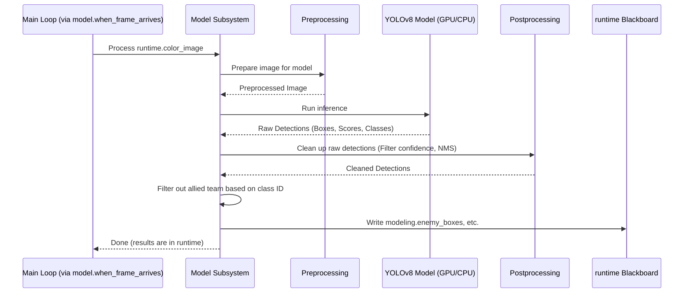

# Chapter 5: Model Subsystem

In the [previous chapter](04_video_stream_subsystem_.md), we learned how the [Video Stream Subsystem](04_video_stream_subsystem_.md) acts like the eyes of our robot, providing a constant stream of images. But just *seeing* isn't enough – the robot needs to *understand* what it's seeing. Specifically, it needs to find the enemy robots in the picture.

How can a computer look at a picture and pick out specific objects, like enemy robots? This sounds like a job for a brain!

## The Problem: Recognizing Patterns in Pixels

A camera image is just a grid of colored dots (pixels). How do we go from this raw grid of pixels to knowing "Aha! There's an enemy robot located *here* in the image"? Humans do this effortlessly, but for a computer, it requires a special kind of "pattern recognition brain."

## The Solution: The Model Subsystem - The Digital Brain's Vision Cortex

The **Model Subsystem** is designed to be this pattern recognition part of our robot's brain.

*   **Its Job:** To take the raw image frame provided by the [Video Stream Subsystem](04_video_stream_subsystem_.md) (via the [Shared Runtime Data (`runtime`)](03_shared_runtime_data___runtime___.md)) and analyze it.
*   **How it Works:** It uses a powerful tool called a **Machine Learning (ML) Model**. Think of this ML model like a mini-brain that has been trained on thousands or millions of images to become really good at spotting specific things – in our case, robots. A popular type of model for this is called YOLO (You Only Look Once), and we use a version called YOLOv8.
*   **What it Outputs:** When the model finds something it thinks is a robot, it doesn't just say "I found one!". It tells us:
    1.  **Where it is:** It draws an imaginary rectangle around the detected robot in the 2D image. This rectangle is called a **Bounding Box**. We'll learn more about these in the next chapter, [BoundingBox](06_boundingbox_.md).
    2.  **How sure it is:** It gives a **Confidence Score**, usually a number between 0 and 1 (or 0% to 100%). A score of 0.9 means "I'm 90% sure this is a robot."
*   **Filtering:** Since robot competitions often involve two teams (e.g., red vs. blue), the model might detect robots from *both* teams. The Model Subsystem has an extra step to filter out any detected robots that belong to *our* team (the "allied" team), leaving only the potential enemy targets.

## How the Main Loop Uses the Model

The [Main Execution Loop](01_main_execution_loop_.md) relies on the Model Subsystem early in its cycle, right after getting a new image.

```python
# File: main.py (Simplified loop)

from subsystems import video_stream, model # Import subsystems
from toolbox.globals import runtime # Import shared data

# Get the latest frame data and put it in runtime
for runtime.frame_number, runtime.color_image, runtime.depth_image in video_stream.frames():

    # ---> Tell the Model Subsystem to analyze the image <---
    model.when_frame_arrives()

    # Now, the results (bounding boxes) are in runtime.modeling.*
    # The Aiming system can use them next...
    # aim.when_bounding_boxes_refresh()
    # ... (communicate, log) ...
```

1.  The loop gets the `runtime.color_image` from the [Video Stream Subsystem](04_video_stream_subsystem_.md).
2.  It calls `model.when_frame_arrives()`. This tells the Model Subsystem: "Hey, there's a new image ready in `runtime.color_image`. Please analyze it!"

Inside the `model.when_frame_arrives()` function (which lives in `subsystems/model.py`), the subsystem does its work:

```python
# File: subsystems/model.py (Simplified 'when_frame_arrives')

from toolbox.globals import runtime, config # Import shared data and config
# Import the specific ML model helper (e.g., YOLOv8)
# (This happens based on settings in config)
# from subsystems.modeling.yolo_v8 import model # Conceptual

def when_frame_arrives():
    # 1. Get the latest image FROM the runtime blackboard
    frame = runtime.color_image
    
    # 2. Use the ML model to find *all* potential objects
    #    (gets boxes, confidence scores, and class IDs like 'red' or 'blue')
    all_boxes, confidences, class_ids = model.get_bounding_boxes(
        frame=frame,
        minimum_confidence=config.model.minimum_confidence, # Use setting from config
    )
    
    # 3. Filter out boxes belonging to our team's color
    our_team_color = config.our_team_color # Get our color from config
    enemy_boxes, enemy_confidences, _ = filter_plate_color(
        all_boxes, confidences, class_ids, our_team_color
    )
        
    # 4. Put the results ONTO the runtime blackboard
    #    (under the 'modeling' section)
    runtime.modeling.bounding_boxes = all_boxes # All detected boxes
    runtime.modeling.enemy_boxes = enemy_boxes # Only enemy boxes
    runtime.modeling.confidences = enemy_confidences # Confidences for enemy boxes
    # ... other data like best_bounding_box might be set later by aim ...
```

Let's break this down:
1.  **Get Image:** It reads the `runtime.color_image` that the main loop just received.
2.  **Detect Objects:** It calls the loaded ML model (like `model.get_bounding_boxes`) to analyze the image. This function returns lists of bounding boxes, their confidence scores, and usually an ID indicating the class of the object detected (e.g., which color robot plate was seen). It uses a `minimum_confidence` setting from the [Global Configuration (`config`)](02_global_configuration___config___.md) to ignore detections the model isn't very sure about.
3.  **Filter Allies:** It calls a helper function (`filter_plate_color`) to remove detections whose class ID matches our team's color (also specified in `config`).
4.  **Store Results:** It takes the results (the list of all boxes found, the list of *enemy* boxes, and their corresponding confidences) and writes them back onto the shared blackboard under `runtime.modeling`.

Now, the `runtime.modeling.enemy_boxes` contains the information the [Aiming Subsystem (`aim`)](07_aiming_subsystem___aim___.md) needs to figure out where to point!

## Under the Hood: How Does the Model Recognize Robots?

Machine learning models like YOLOv8 are complex, but here's a simplified idea of the steps involved when `model.get_bounding_boxes` is called:

1.  **Preprocessing:** The input image (`frame`) might need to be resized or adjusted (like changing brightness/contrast slightly or rearranging color channels) to match exactly what the ML model expects. Our YOLOv8 code handles this.
2.  **Inference:** The preprocessed image is fed into the trained ML model. The model is essentially a complex network of mathematical operations (like a deep neural network). It processes the image through its layers, looking for patterns it learned during training. This step often uses the computer's graphics card (GPU) or special hardware accelerators (like NVIDIA TensorRT) if available (configured via `config.model.hardware_acceleration`) to run much faster than on the main processor (CPU).
3.  **Raw Output:** The model outputs raw data, often including many overlapping potential bounding boxes with associated confidence scores and class predictions (e.g., "red robot", "blue robot").
4.  **Postprocessing:** This raw output needs cleaning up:
    *   **Confidence Thresholding:** Boxes with confidence below the `minimum_confidence` setting are thrown away.
    *   **Non-Max Suppression (NMS):** Often, the model detects the same object multiple times with slightly different, overlapping boxes. NMS is a technique to keep only the single best box for each distinct object and discard the redundant ones.
    *   **Formatting:** The final boxes, confidences, and class IDs are organized into lists.

Here's a simplified diagram of the process *within* the Model Subsystem for one frame:



## Loading the Right Model

How does the system know to use YOLOv8? Just like the [Video Stream Subsystem](04_video_stream_subsystem_.md) checked `config` to load the right camera code, the Model Subsystem checks `config` to load the right model code.

```python
# File: subsystems/model.py (Simplified setup part)

from toolbox.globals import config, runtime # Import config
from super_map import LazyDict # For organizing model data

# Where the actual model object and functions will be stored
model = LazyDict() 

# Check the config settings
which_model = config.model.which_model
hardware_acceleration = config.model.hardware_acceleration

# Load the specific model code based on the setting
if which_model == 'yolo_v8':
    print(f"Loading YOLOv8 model (acceleration: {hardware_acceleration})...")
    # Import the initialization function for YOLOv8
    from subsystems.modeling.yolo_v8 import init_yolo_v8
    # Call the function to load the model and set up its methods
    # (like get_bounding_boxes) inside the 'model' object
    init_yolo_v8(model) 
else:
    raise Exception(f"Model '{which_model}' not supported.")

# Now, model.get_bounding_boxes exists and points to the YOLOv8 version.
```

This code runs when the program starts. It looks at `config.model.which_model` and `config.model.hardware_acceleration`. If `which_model` is `'yolo_v8'`, it imports and runs `init_yolo_v8` from a separate file (`subsystems/modeling/yolo_v8.py`). That initialization function handles loading the actual YOLOv8 model files (e.g., `.pt` or `.engine` files specified in `config` via `path_to`) and sets up the `model.get_bounding_boxes` function we saw earlier. This keeps the main `model.py` file cleaner and allows different ML models to be plugged in more easily.

## Conclusion

The **Model Subsystem** is the pattern-recognition powerhouse of our auto-aim system. It takes the image from the camera stream, uses a sophisticated Machine Learning model (like YOLOv8) chosen via the [Global Configuration (`config`)](02_global_configuration___config___.md), and identifies potential enemy robots within that image.

It outputs the locations of these enemies as bounding boxes, along with confidence scores, placing this crucial information onto the [Shared Runtime Data (`runtime`)](03_shared_runtime_data___runtime___.md) blackboard. It intelligently filters out detections of allied robots, ensuring the subsequent aiming step focuses only on valid targets. This subsystem bridges the gap between seeing pixels and identifying objects of interest.

The primary output of this subsystem is a list of bounding boxes. But what exactly *is* a bounding box in our code? Let's dive into that data structure in the next chapter.

Next: [Chapter 6: BoundingBox](06_boundingbox_.md)

---

Generated by [AI Codebase Knowledge Builder](https://github.com/The-Pocket/Tutorial-Codebase-Knowledge)