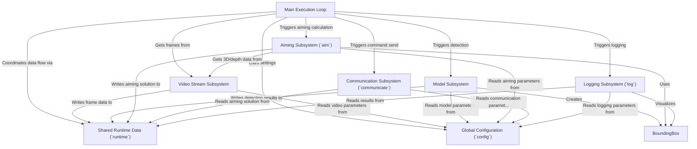

# Tutorial: main

This project is an **auto-aiming system** for a robot.
It uses a *camera* (Video Stream Subsystem) to capture images, then runs a *machine learning model* (Model Subsystem) to **detect** enemy robots and output their locations as *bounding boxes*.
The *Aiming Subsystem* calculates the **best target** and its 3D coordinates.
Finally, the *Communication Subsystem* **sends** these aiming coordinates to the robot's hardware, while the *Logging Subsystem* records data and can display the process visually.
The *Main Execution Loop* **orchestrates** this entire process for every camera frame, using *Global Configuration* for settings and *Shared Runtime Data* to pass information between subsystems.

**Source Repository:** [None](None)

## Chapters

1. [Main Execution Loop
](01_main_execution_loop_.md)
2. [Global Configuration (`config`)
](02_global_configuration___config___.md)
3. [Shared Runtime Data (`runtime`)
](03_shared_runtime_data___runtime___.md)
4. [Video Stream Subsystem
](04_video_stream_subsystem_.md)
5. [Model Subsystem
](05_model_subsystem_.md)
6. [BoundingBox
](06_boundingbox_.md)
7. [Aiming Subsystem (`aim`)
](07_aiming_subsystem___aim___.md)
8. [Communication Subsystem (`communicate`)
](08_communication_subsystem___communicate___.md)
9. [Logging Subsystem (`log`)
](09_logging_subsystem___log___.md)

---

Generated by [AI Codebase Knowledge Builder](https://github.com/The-Pocket/Tutorial-Codebase-Knowledge)